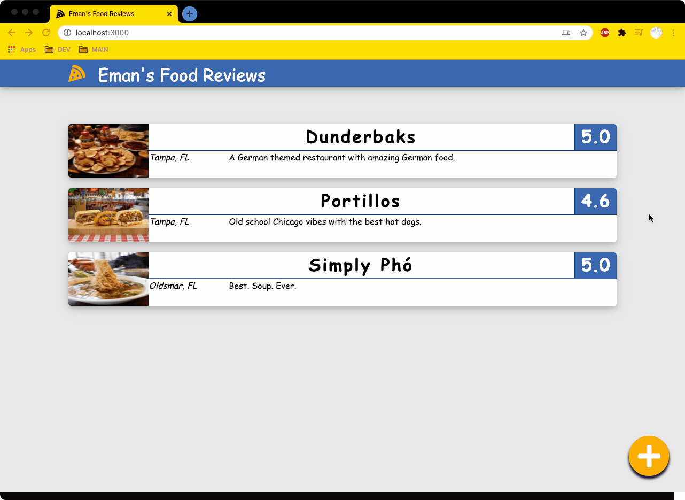

# react-food-reviews

## Table of Contents
* [General Info](#general-info)
* [Technologies](#technologies)
* [Setup](#setup)

## General info
A restaurant review app. First react project so doesn't follow common standards/practices as much as I wanted. The project is rooted in one App component and isn't broken apart. Built with react Hooks, no API calls/back-end.

<!--  -->


## Technologies
Project is created with:
* React : ^17.0.1
* React-Dom: ^17.0.1
* NPM: 6.14.4
* Node: 12.16.3

## Setup
To run this project, install it locally using npm:

```
$ cd ../reactscheduler
$ npm install
$ npm start
```
